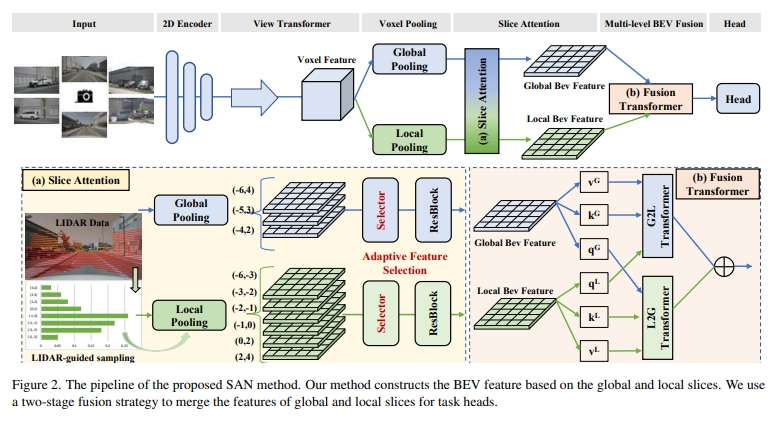

# BEV-SAN: Accurate BEV 3D Object Detection via Slice Attention Networks
The official release of BEV-SAN is now available.


[](https://arxiv.org/abs/2212.01231)



## Updates!!
* 【2023/10/24】 We publish the code base of our work. Updating soon.
* 【2023/02/24】 Our work has been accepted by the CVPR2023.
## Quick Start
### Installation
**Step 0.** Install [pytorch](https://pytorch.org/)(v1.9.0).

**Step 1.** Install [MMDetection3D](https://github.com/open-mmlab/mmdetection3d)(v1.0.0rc4).

**Step 2.** Install requirements.
```shell
pip install -r requirements.txt
```
**Step 3.** Install BEVDepth(gpu required).
```shell
python setup.py develop
```

### Data Preparation
**Step 0.** Download nuScenes official dataset.

**Step 1.** Symlink the dataset root to `./data/`.
```
ln -s [nuscenes root] ./data/
```
The directory will be as follows.
```
BEVDepth
├── data
│   ├── nuScenes
│   │   ├── maps
│   │   ├── samples
│   │   ├── sweeps
│   │   ├── v1.0-test
|   |   ├── v1.0-trainval
```
**Step 2.** Prepare infos.
```
python scripts/gen_info.py
```
**Step 3.** Prepare depth gt.
```
python scripts/gen_depth_gt.py
```

### Tutorials
**Train.**
```
python [EXP_PATH] --amp_backend native -b 8 --gpus 8
```
**Eval.**
```
python [EXP_PATH] --ckpt_path [CKPT_PATH] -e -b 8 --gpus 8
```

**

## Cite BEV-SAN
If you use BEV-SAN in your research, please cite our work by using the following BibTeX entry:

## Thanks
Our code is based on the BEVDepth(https://github.com/Megvii-BaseDetection/BEVDepth)

```latex
@misc{chi2022bevsan,
      title={BEV-SAN: Accurate BEV 3D Object Detection via Slice Attention Networks}, 
      author={Xiaowei Chi and Jiaming Liu and Ming Lu and Rongyu Zhang and Zhaoqing Wang and Yandong Guo and Shanghang Zhang},
      year={2022},
      eprint={2212.01231},
      archivePrefix={arXiv},
      primaryClass={cs.CV}
}
```
